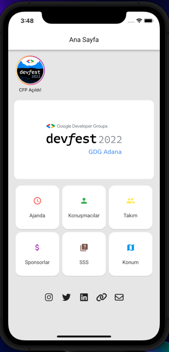
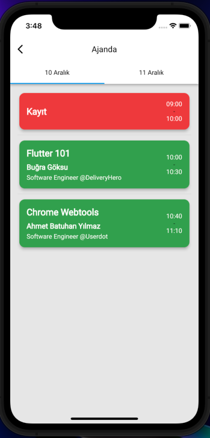
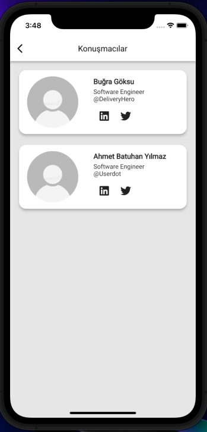
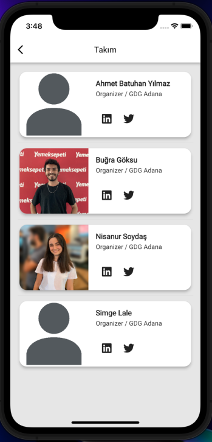
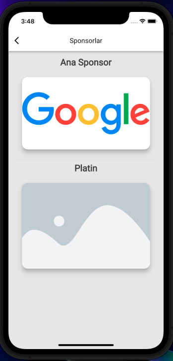
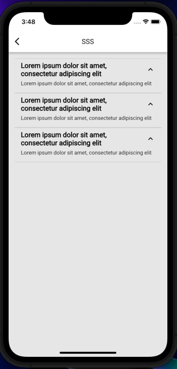

# GDG DevFest App 

<p align="center">

</p>
<p align="center">
<a target="_blank" href='https://play.google.com/store/apps/details?id=com.gdgadana.devfest'></a>
<!-- <a target="_blank" href='https://apple.co/2YC0Zgb'></a> -->

</p>
<p align="center"><a href="#getting-started">:rocket: Get Started</a></p>

## 📸 ScreenShots

|                        |                            |
| :----------------------------------: | :----------------------------------: |
|  |  | 
|  |  | 
|  |  | 

### Show some :heart: and star the repo to support the project

## Overview

DevFest Mobile application is for all the GDG Devfests around the world. You can see the agenda, speakers, organizers, sponsors, faq. It's fully customizable from Remote Config.


## Technology Stack
- Storyly
- Clean Architecture
- BLoC
- GetIt
- Injectable
- Freezed
- JsonSerializable
- Firebase
    * Firestore
    * Notifications (now Android only)
    * Remote Config


## Getting Started

- Create Firebase project and connect with Flutter. [See more details.](https://firebase.google.com/docs/flutter/setup)


- Add _key.properties_ file under android/ 
```
storePassword=<password from previous step>
keyPassword=<password from previous step>
keyAlias=upload
storeFile=<location of the key store file, such as /Users/<user name>/upload-keystore.jks>
```

- Open [gdg-devfest-app\lib\main.dart](https://github.com/gdgadana/devfest/blob/master/lib/main.dart) and update default configs for Remote Config
```
await remoteConfig.setDefaults({
    RemoteConfigKey.appTitle.name: "'DevFest''22 Adana",
    RemoteConfigKey.bannerUrl.name:
        "https://firebasestorage.googleapis.com/v0/b/devfest-adana-6723f.appspot.com/o/devfest_logo.png?alt=media",
    RemoteConfigKey.linkedinCompanyUsername.name: "gdg-adana",
    RemoteConfigKey.twitterUsername.name: "gdg_adana",
    RemoteConfigKey.instagramUsername.name: "gdg_adana",
    RemoteConfigKey.mailUrl.name: "mailto:info@gdgadana.org?subject=Devfest'22%20Adana",
    RemoteConfigKey.webUrl.name: "https://linktr.ee/gdgadana",
    RemoteConfigKey.eventLocation.name: "37.0346193,35.2556483",
    RemoteConfigKey.eventGoogleMapsWebUrl.name: "https://goo.gl/maps/RGYmHmpz1Go9WBm27",
  });
```
 
- Open [Remote Config ](https://firebase.google.com/products/remote-config)

    * Add configs for these names : 

    ```
    bannerUrl
    appTitle
    instagramUsername
    twitterUsername
    linkedinCompanyUsername
    webUrl
    mailUrl
    eventGoogleMapsWebUrl
    eventLocation
    isStorylyEnabled
    storylyAndroidKey
    storylyIOSKey
    ```   
    If you don't want to enable story feature set _isStorylyEnabled_ -> false
    
    For storylyAndroidKey & storylyIOSKey [visit here.](https://www.storyly.io/)

- Add Firestore collections. Visit [lib/utils/constants.dart](https://github.com/gdgadana/devfest/blob/master/lib/utils/constants.dart)
    ```
    static const teamCollectionName = 'team';
    static const sponsorCollectionName = 'sponsor';
    static const faqCollectionName = 'faq';
    static const agendaCollectionName = 'agenda';
    ```
    * Agenda (example structure)
    ``` 
    "day":string,
    "order": int,
    "sessions":
    [{
        "title":string,
        "desc":desc,
        "startTime":string,
        "endTime":string,
        "order":int,
        "speaker":{
            "name":string,
            "image":string,
            "company":string,
            "title":string,
            "linkedin":string,
            "twitter":string,
        }
    }]
    ```
    * Sponsor (example structure)
    ```
    "name":string,
    "image"string,
    "type":string,
    "url":string,
    "order":int
    ```
    
    * Team (example structure)
    ```
    "name":string,
    "title":string,
    "image"string,
    "linkedin":string,
    "twitter":string,
    "order":int
    ```
    * FAQ (example structure)
    ```
    "question":string,
    "answer":string,
    "order":int
    ```


## 🤓 Author
**Buğra Göksu**  
 [](https://twitter.com/bugragoksu)

**Inspiring:** [Pawan Kumar - GDG DEVFEST APP](https://github.com/iampawan/GDG-DevFest-Appiampawan)

## Contributing
Feel free to use GitHub issues for questions, bug reports, and feature requests.
## License

Project is published under the [MIT license](/LICENSE.md).


_DevFest App is not endorsed and/or supported by Google, the corporation._